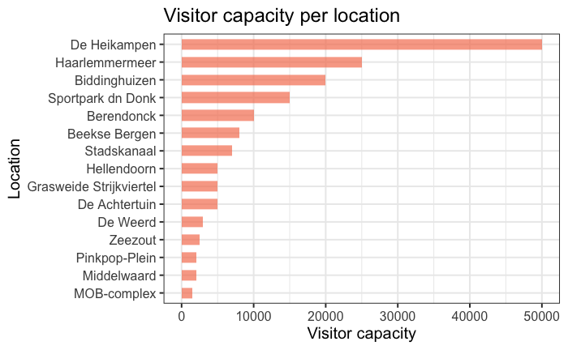
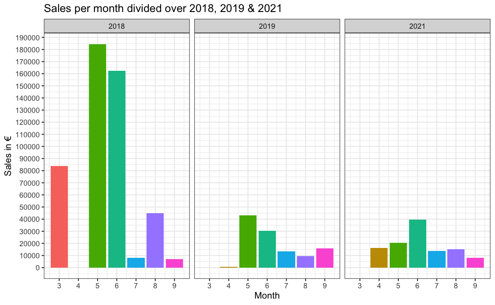
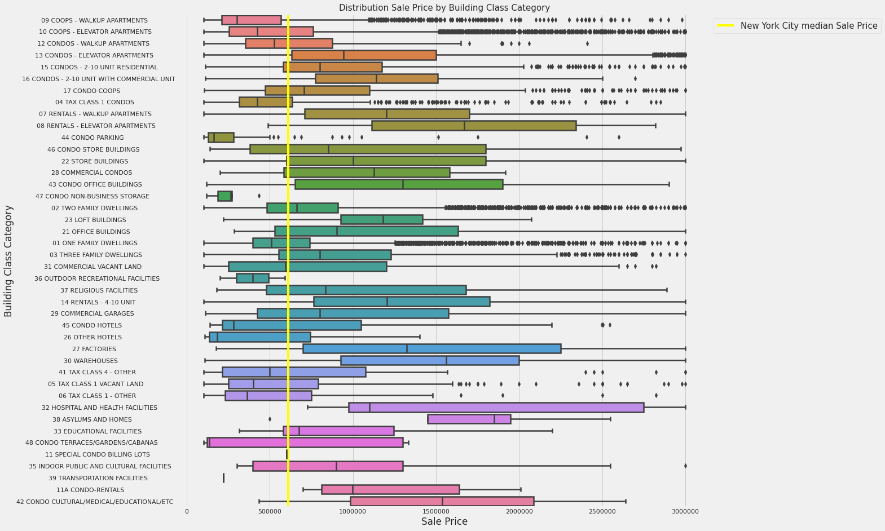
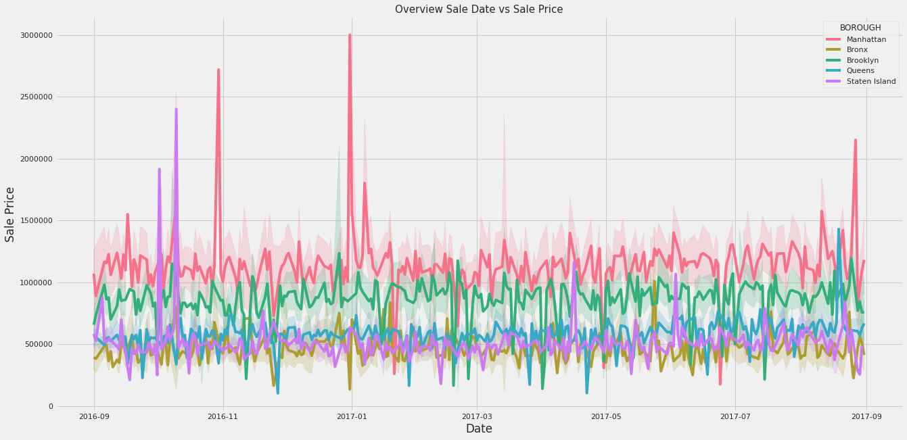

## Welcome to GitHub Pages

You can use the [editor on GitHub](https://github.com/MLP99/milan_portfolio/edit/gh-pages/index.md) to maintain and preview the content for your website in Markdown files.

Whenever you commit to this repository, GitHub Pages will run [Jekyll](https://jekyllrb.com/) to rebuild the pages in your site, from the content in your Markdown files.

# Project 1: Festivate Exploratory Data Analysis
For this school project my group members and I started a fictional company called Festivate to help fictional festival organizers to gain more insights from their data in order to help with decision making. I designed the SQL database for this project for the festival organizers and used R to manipulate and visualize data.

* Designed a SQL database for the festival organizers
* Used SQL to write queries to gain insights about revenue, logistics, festivals and festival visitors
* Used also R for the Exploratory Data Analysis (EDA) to modify en visualize data in order to extract insights

## Some findings:

# Project 2: New York City Property Sales Predictor
Currently I'm working on a machine learning project to predict the price of properties in NYC and includes data about 80,000 properties. Besides the data set about the properties, I'm using another data set with demographic information about the NYC population and merged them together in order to predict property prices.

* Using Python for data cleaning and the Exploratory Data Analysis (EDA)
* Achieved a decrease of the Mean Absolute Error (MAE) on every property in the test data with 48% by only using feature engineering
* Currently using Hyper Parameter Tuning in order to boost my models predicting performance

## Some findings:

